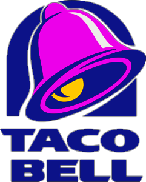

Challenge 1 Assignment
By Kristin Peters

# The Use of AI in the QSR Space: A Yum! Brands - Taco Bell Case Study

## Introduction

This case study will dive into AI applications within the Quick Service Restaurant (QSR) space, examining how fast food brand Taco Bell has successfully implemented AI into marketing and operations practices to drive improved sales.

## Company Origins

Taco Bell was founded on March 21, 1962 by Glen Bell in Downey, California. The first fast food restaurant chain, McDonalds, had been founded in the same city only nine years earlier.

Initially, Taco Bell started as a small drive-thru called "Taco Tia," but Bell later rebranded it as Taco Bell. The fast food chain became popular for serving Mexican-inspired dishes, such as tacos, burritos, and nachos, at affordable prices. It quickly expanded, and by the late 1960s, Taco Bell had begun franchising its locations.

The company was acquired by PepsiCo in 1978 as a part of PepsiCo’s broader expansion strategy into the fast food space. PepsiCo had already acquired Pizza Hut in 1977, and decided to add Taco Bell to the portfolio – this acquisition fueled Taco Bell’s rapid expansion across the country. Due to the growing operational complexities of running a successful chain of fast food restaurants and franchises, PepsiCo decided to spin off its fast food portfolio, which by that time also included KFC (acquired in 1986). In 1997, the Tricon Global Restaurants Group was created to manage the fast food brands. Tricon later rebranded to Yum! Brands in 2002, and still retains that name today.

## The Issues

As a result of the global pandemic, Taco Bell’s sales had declined ~30%, and the company was looking for ways to increase overall sales to new customers and also to increase frequency of purchase with existing customers.  The organization was searching for a way to recover lost sales and to improve their growth trajectory. Through the work of [Joe Park](https://www.linkedin.com/in/josephrpark/) (Chief Digital and Technology Officer at YumBrands), [Melissa Friebe](https://www.linkedin.com/in/melissafriebe/) (Chief Brand Strategy Officer for Taco Bell) and [Taylor Montgomery](https://www.linkedin.com/in/taylor-montgomery-b5a96947/) (Chief Marketing Officer for Taco Bell North America), the Taco Bell organization decided to incorporate AI into marketing and operations practices in the hopes of improving their topline growth. 

## Business Activities

Taco Bell primarily targets a youthful audience, with a focus on individuals aged 18 to 34. This demographic includes college students, young professionals, and "late-night eaters." These customers value affordability, convenience, and bold flavors. Taco Bell positions itself as an accessible and fun option, appealing to people who seek quick meals with a sense of adventure. The brand also emphasizes its appeal to budget-conscious consumers, making it a go-to choice for those seeking tasty meals without breaking the bank.  

Taco Bell is ranked approximately 4th in Market Share for Total Revenue in the roughly $337.8 billion North American Fast Food Market, behind McDonalds, Chick-Fil-A, and Starbucks. Taco Bell’s global revenue in 2023 was $15Bn, with $11Bn of that coming from the North American market.  In 2019, the average sales per Taco Bell unit in the U.S. were approximately $1.6 million. By 2023, this figure increased to about $2.1 million per unit, indicating a significant rise in unit-level sales.

Taco Bell has been leading the way in testing AI-powered voice ordering in drive-thrus. This includes integrating the AI system with loyalty programs to suggest personalized items based on customer preferences, which can include previous order history or dietary needs. This system is being rolled out across multiple states, allowing the AI to refine its accuracy and efficiency. The goal is to improve order speed and accuracy while addressing staffing challenges, a key concern in the post-pandemic labor market​.

## Solutions They Offer 

According to Joe Park, Yum Brands' Chief Digital and Technology Officer: 
*"Our vision is really to make sure that our franchisees have the best technologies to run their
restaurants. Marketing is certainly used to drive top-line growth, so it’s always been something that we’ve planned
for. The personalized AI-driven marketing is something that’s more recent.  In the pilot, we delivered emails that were customized at an individual level. When we look at factors like the time of day, the day of the week, the subject line in the email, the content, and more, you can optimize that for
marketing use cases like upselling, retention, referrals and
even win-back strategies."*

In a recent Wall Street Journal interview, Park stated, *"Our goal is to give our consumers better- timed offers, personalized content and tailored interactions so they feel understood and don’t receive generic clutter.  We have pre-written messages and we are using AI to select from them and decide when to deliver them
and how. We use a mix of both internally developed and third-party
AI tools, and we’re finding potential audiences and
customizing their respective offers, and really using
automation to do that.
If you’re a marketeer, traditional AB testing methods are
used—the consumer wants something in red, or is it in
blue, and which one wins? That can be slow and limited in
how we test. What’s different with this pilot is we can move to AI testing, called reinforcement learning. Instead of waiting weeks for test results, we’re seeing real-time
results that we’re continuously fine-tuning."*

